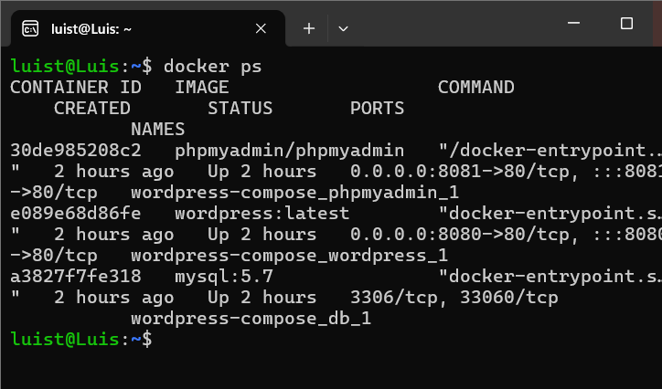
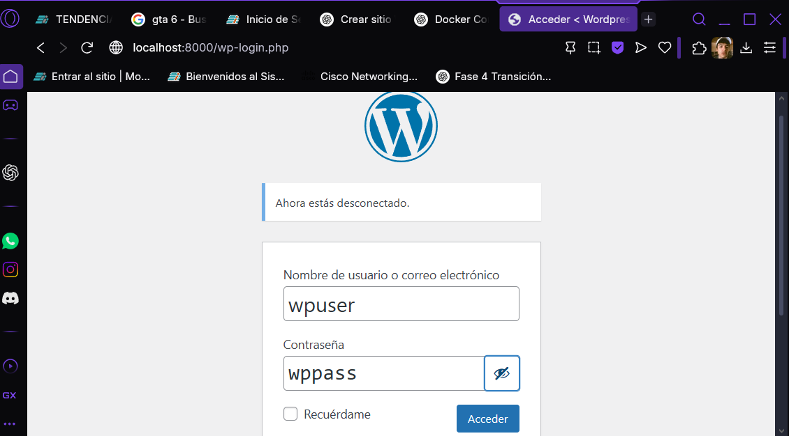
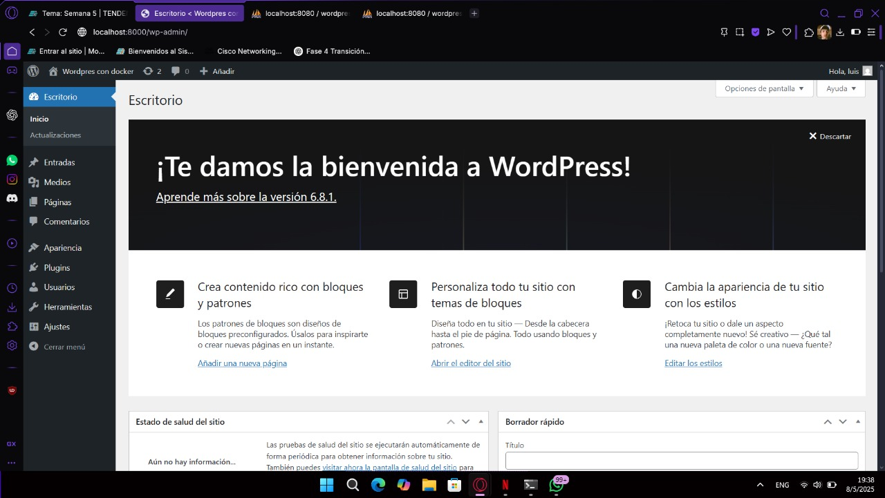
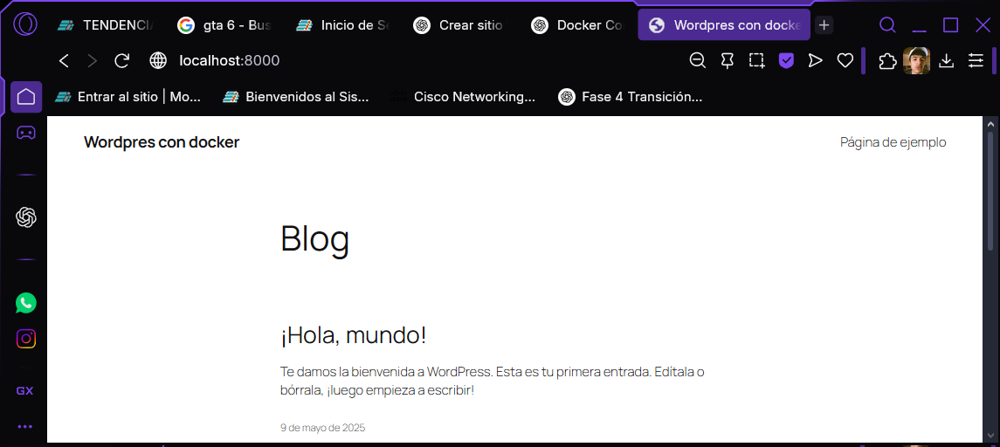
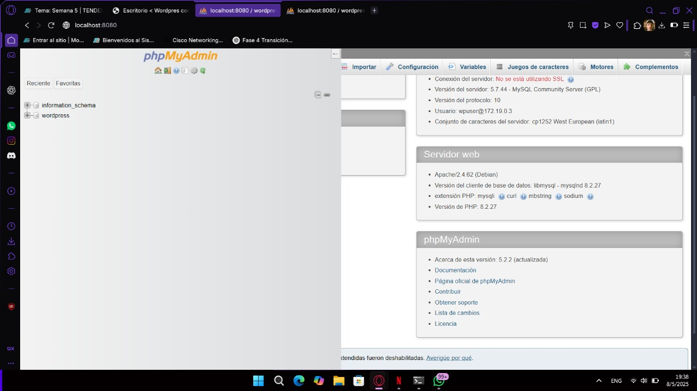
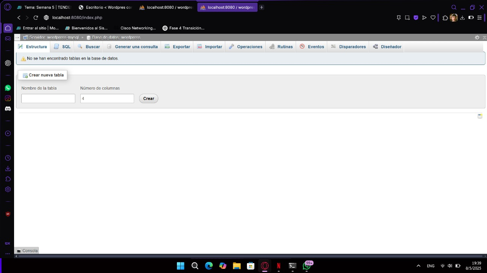

# Práctica de uso de Docker con WordPress, MySQL y phpMyAdmin

## 1. Título  
Implementación de contenedores WordPress, MySQL y phpMyAdmin en red personalizada usando Docker

## 2. Tiempo de duración  
El tiempo aproximado que me tomó realizar esta práctica fue de 90 minutos.

## 3. Fundamentos  
En esta práctica se configuraron tres servicios con Docker: un sitio WordPress, un servidor MySQL y un cliente phpMyAdmin, cada uno en su propio contenedor. Se creó una red personalizada en Docker para conectar los servicios y se utilizaron volúmenes para asegurar la persistencia de los datos.  

### Conceptos clave:
- **Docker**: Plataforma de contenedores que permite ejecutar aplicaciones de forma aislada.
- **MySQL**: Base de datos relacional utilizada por WordPress para almacenar contenido.
- **phpMyAdmin**: Interfaz web para administrar bases de datos MySQL fácilmente.
- **WordPress**: Sistema de gestión de contenido (CMS) muy utilizado para crear sitios web.
- **Docker Network**: Permite que los contenedores se comuniquen entre sí.
- **Volúmenes**: Permiten que los datos persistan aunque el contenedor se elimine.

## 4. Conocimientos previos  
- Uso de terminal comados de Linux.
- Manejo básico de Docker (comandos de red, volumen, contenedor).
- Bases de datos relacionales y credenciales.
- Navegación en localhost desde navegador.

## 5. Objetivos  
- Crear una red personalizada en Docker.
- Crear volúmenes persistentes para WordPress y MySQL.
- Desplegar MySQL con una base de datos y credenciales personalizadas.
- Implementar phpMyAdmin para gestión gráfica de la base de datos.
- Desplegar WordPress conectado a la base de datos.
- Validar que todos los contenedores funcionen y se comuniquen correctamente.

## 6. Equipo necesario  
- Computadora con Docker instalado.
- Navegador web (Firefox, Chrome).
- Conexión a internet.
- 8 GB de RAM mínimo.

## 7. Material de apoyo  
- Documentación oficial de Docker  
- Documentación de MySQL
- Documentación phpMyAdmin
- WordPress Docs
## 8. Procedimiento

### Paso 1: Crear red 
```
docker network create wordpress-net
```
#### Paso 2: Crear volúmenes persistentes
```
- docker volume create wordpress-data
- docker volume create mysql-data
```


#### Paso 3: Crear contenedor MySQL
```
docker run -d \
  --name wordpress-mysql \
  --network wordpress-net \
  -e MYSQL_ROOT_PASSWORD=rootpass \
  -e MYSQL_DATABASE=wordpress \
  -e MYSQL_USER=wpuser \
  -e MYSQL_PASSWORD=wppass \
  -v mysql-data:/var/lib/mysql \
  mysql:5.7
```

#### Paso 4: Crear contenedor phpMyAdmin
```
docker run -d \
  --name my-phpmyadmin \
  --network wordpress-net \
  -e PMA_HOST=wordpress-mysql \
  -p 8080:80 \
  phpmyadmin/phpmyadmin

```
- Acceso web: http://localhost:8080
- Credenciales de acceso:

- Servidor: wordpress-mysql

- Usuario: wpuser

- Contraseña: wppass
#### Paso 5: Crear contenedor WordPress
```
docker run -d \
  --name my-wordpress \
  --network wordpress-net \
  -e WORDPRESS_DB_HOST=wordpress-mysql:3306 \
  -e WORDPRESS_DB_NAME=wordpress \
  -e WORDPRESS_DB_USER=wpuser \
  -e WORDPRESS_DB_PASSWORD=wppass \
  -p 8000:80 \
  -v wordpress-data:/var/www/html \
  wordpress

```
- Acceso web: http://localhost:8000
- Desde ahí se completa la instalación guiada de WordPress.
## 9. Resultados esperados
- Se crearon y ejecutaron los siguientes contenedores:

* MySQL como servidor de base de datos.

* phpMyAdmin para gestión web de MySQL.

* WordPress como sitio web conectado a MySQL.



- Todos los servicios se conectaron mediante la red 

- Se pudo acceder y configurar WordPress desde el navegador.


- Se validó el acceso correcto a la base de datos desde phpMyAdmin.



Esta práctica permitió comprender cómo desplegar un entorno web completo utilizando Docker. Se lograron crear contenedores independientes pero conectados entre sí mediante redes personalizadas, lo cual es clave para entornos de desarrollo escalables y portables. Se usaron volúmenes para asegurar la persistencia de los datos, y la configuración fue rápida y flexible gracias a Docker.

### 10. Audio
Link: https://voca.ro/163GKVj8dPU1 
### 11 Bibliografia
- Doker. (2025b, febrero 27). Docker Documentation. https://docs.docker.com/
- MySQL :: MySQL Documentation. https://dev.mysql.com/doc/
- Welcome to phpMyAdmin’s documentation! — phpMyAdmin 5.2.3-dev documentation. https://docs.phpmyadmin.net/en/latest/
